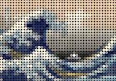

img2dots
====
make a dots picture from image.

## Description
img2dots.py makes a dots picture from image.


-->


```
 python img2dots.py  [-d vertical_dots ] [-o output_file] image_file
```

## Installation
```
git clone git://github.com/zom-1/img2dots .
```

## Example
```
python img2dots.py namiura.jpg
python img2dots -d 20 -o output.jpg namiura.jpg
```

## Requirement
Pillow or PIL 

<!--
## See also
-->

## Licence
Copyright (c) 2016 zom-1, Released under the
 [MIT](http://opensource.org/licenses/mit-license.php) license

## Author
[zom-1](https://github.com/zom-1)
